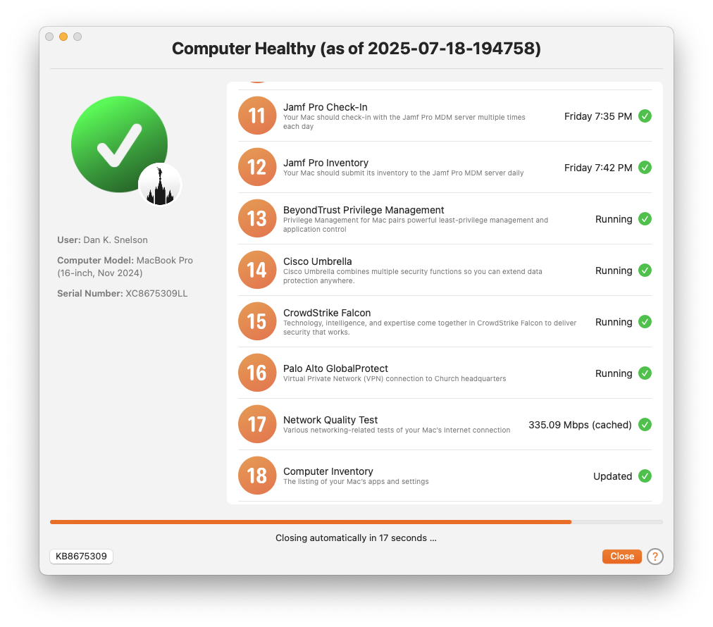
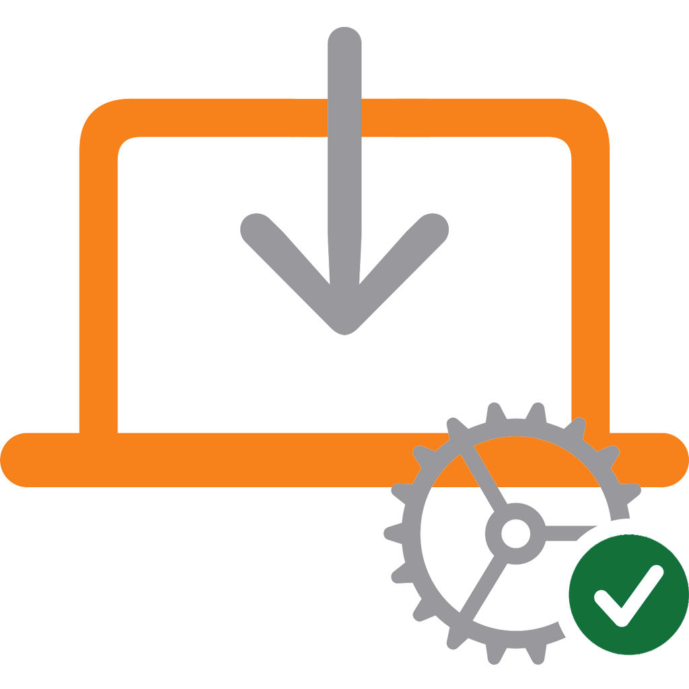

## Dan K. Snelson
### In-the-trenches senior systems engineer, expert in macOS / iOS Enterprise Mobility Management (EMM / MDM) in mixed environments

[Apple](https://www.credly.com/badges/d5aa83a0-1f2b-4684-9a91-0b3e6e98c78e/linked_in?t=snmqhu)- and [Jamf](https://community.jamf.com/t5/badges/userbadgespage/user-id/12915/)-certified, senior systems engineer with more than 30 years of experience contributing to and leading diverse teams who provide design, implementation and support engineering services which consistently delight stakeholders.

Proven history of leveraging personnel strengths and the latest technologies to realize enterprise-wide process improvements.

Engaging presenter and seasoned communicator capable of building relationships with all levels of management, while inspiring passion and drive to meet internal and external stakeholders' goals.

- [Blog](https://snelson.us)
- [LinkedIn](https://www.linkedin.com/in/danksnelson/)
- [Jamf Nation](https://community.jamf.com/members/dan-snelson-12379)

---

# Featured Projects

## [Mac Health Check](https://github.com/dan-snelson/Mac-Health-Check/blob/main/README.md)

Mac Health Check provides a practical and user-friendly approach to surfacing Mac compliance information directly to end-users via Jamf Pro Self Service.

- [snelson.us/mhc](https://snelson.us/mhc)

## [Setup Your Mac](https://github.com/setup-your-mac/Setup-Your-Mac/blob/main/README.md)

Setup Your Mac aims to simplify initial device configuration by leveraging swiftDialog and Jamf Pro Policy Custom Events to allow end-users to self-complete Mac setup post-enrollment.

- [snelson.us/sym](https://snelson.us/sym)

---

# Featured Presentations

## [U of U Mac Admins, July 2025 — Mac Health Check](https://stream.lib.utah.edu/index.php?c=details&id=13709)

Mac Health Check provides a practical and user-friendly approach to surfacing Mac compliance information directly to end-users via Jamf Pro Self Service.

## [JNUC 2024 — Just Enough of a Good Thing: User-Friendly and Database-Optimized Inventory Updating](https://www.youtube.com/watch?v=I1w9fl57fpE&t=14s)

Provide users more detailed feedback when updating inventory via Jamf Pro, at durations **you** specify

## [JNUC 2023 — Setup Your Mac: Racing Stripes, Gotchas and “One More Thing”](https://www.youtube.com/watch?v=hJUJnaQ_2MI)

Apple’s Automated Device Enrollment helps streamline Mobile Device Management (MDM) enrollment and device supervision during activation, enabling IT to manage enterprise devices with “zero touch.”

Setup Your Mac aims to simplify initial device configuration by leveraging swiftDialog and Jamf Pro policy “Custom Events” to allow end-users to self-complete Mac setup post-enrollment.

## [JNUC 2022 — Your Internal Beta Test Program '22: Invitation-Only Betas](https://snelson.us/2022/09/invitation-only-betas/)

As a follow-up to the JNUC 2019 "Your Internal Beta Test Program: Opt-in, Opt-out via Self Service" session, learn how to architect invitation-only betas for your elite testers for when your organization pilots new endpoint security solutions, like Jamf Protect, while maintaining your current offerings.

## [U of U Mac Admins, July 2022 — Tart Open Source Virtualization for Mac Admins](https://snelson.us/2022/05/testing-sideways-jamf-pro-enrollments-with-tart/)

Learn about Continuous Integration (CI) and how to leverage [Tart](https://slack.com/app_redirect?channel=C03QARN6ATV), an open-source tool to run macOS VMs on Macs with Apple silicon.

## [JNUC 2021 — Nudge users to keep macOS up-to-date with Jamf Pro](https://www.youtube.com/watch?v=6vN9pN0_ZuI)

Nudge is application which reminds your users to keep macOS Big Sur and later up-to-date. Learn how to leverage this open source tool with Jamf Pro.

## [U of U Mac Admins, October 2020 — Presentation Mode](https://github.com/dan-snelson/Presentation-Mode/blob/master/README.md)

Help your users have successful presentations with a [Jamf Pro Self Service policy](https://github.com/dan-snelson/Presentation-Mode) which temporarily extends screensaver password timeouts, computer sleep options and automatic policy executions, then automatically restores approved security settings after a configurable duration.

## [JNUC 2020 — Jamf Pro Policy Editor Lite](https://youtu.be/YB9hYTMapG0)

Make quick work of routine policy version updates with [Jamf Pro Policy Editor Lite](https://github.com/dan-snelson/Jamf-Pro-Policy-Editor-Lite), which leverages the Jamf Pro API to automate routine policy version updates via an interactive Bash script.

## [JNUC 2019 — Your Internal Beta Test Program: Opt-in / Opt-out via Jamf Pro Self Service](https://youtu.be/AhYPVvO7LwM)

In this session, you'll learn how to leverage Jamf Pro's extension attributes, Smart Groups and the API to allow your end users to easily [opt-in and opt-out of your internal beta test program](https://github.com/dan-snelson/Internal-Beta-Test-Program/blob/master/README.md). You'll also learn how to increase end-user engagement and methods to solicit and act on user feedback.

## [JNUC 2017 — Build Extension Attributes](https://www.jamf.com/jamf-nation/discussions/25815/jnuc-2017-how-to-build-extension-attributes)

Making Jamf Pro extensible by allowing you to look at settings on a device is one of the most powerful (and sometimes easiest) things you can do. In this session, we will walk through how to use Extension Attributes. This includes how to create an Extension Attribute, how the Extension Attribute is run and how to scope policies around them. This is a beginner session, so while we won't teach you to write a script, we will show you how to grab basic information and initiate automated tasks from that information.